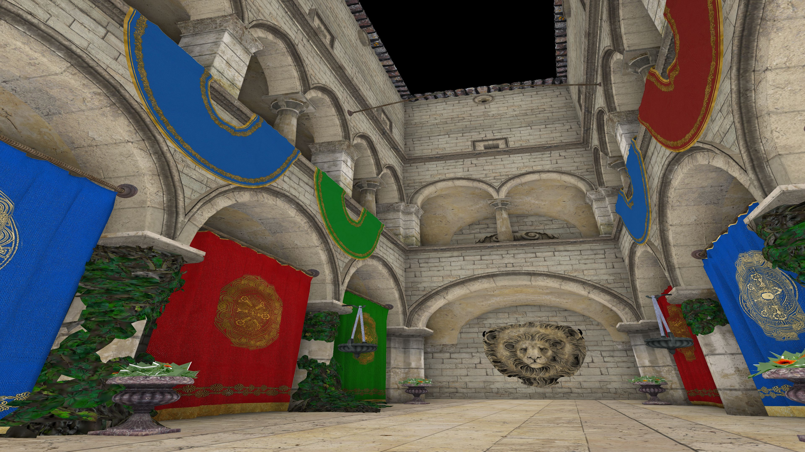

# Screen Space Ambient Occlusion Demo



Quick video summary available [here](https://youtu.be/Js-jTeCUcTE).

Please see [main.cpp](src/main.cpp) for usage documentation.

## System Dependencies
- [meson](https://mesonbuild.com/): Please follow the [beginner's guide](https://mesonbuild.com/SimpleStart.html) to acquire the entire toolchain (including [ninja](https://ninja-build.org/)).
- [SDL2](https://www.libsdl.org/download-2.0.php)
- Graphics drivers supporting OpenGL 4.6

## Building + Running
All code *should* compile across operating systems but has only been tested on Linux.
```
meson setup debug
ninja -C debug/
./debug/demo
```
